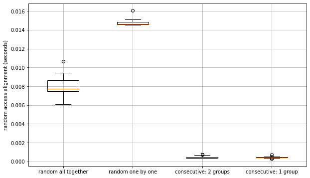

# Notes

## Alignment

  - Sequence stored in numeric format (int8) may be more efficient and allow hack for generating pseudo consensus sequences.
  - HDF5 chunk size should be relatively small
  - consensus sequences computed by bitwise AND over a numpy matrix

## Benchmarking

### Tree size

### Alignment size

### Alignment Query (grouped in the alignment matrix or random rows)

### Alignemnt matrix Chunk size HDF5 storage

__TODO__:
- benchmark chunk size **in both dimensions**

### Compute consensus sequence

### Tree depth and complexity:

h5nodes stored using hdf5 group hierarchy, each group is a Tree node (_may be overkill..._).

With `h5py.File(..., libver='latest')` tree size is no longer a problem (tree with 100K leaves created in less than a minute vs **1 hour for 10times less**)

__TODO__: 
- understand why alignment size matters in terms of performance when creating h5Tree
- check how querying form affect performance:
  - leaves grouped in the alignment matrix
  - retrieve all at once or one by one

### Potentially slow or difficult reordering

__TODO__: 
  - implement tree rearrangements
  - benchmark on the fly rearrangements versus flush at the end of session (like a `Tree.save_h5Tree`) 

__Solutions__:
 - only change ete.Tree object and `flush` these changes to hdf5 once done, or just for saving
 - deal with it... perhaps only suitable for fixed topology.
 - forget about the tree, only use hdf5 to store other kind of data like alignment etc....
